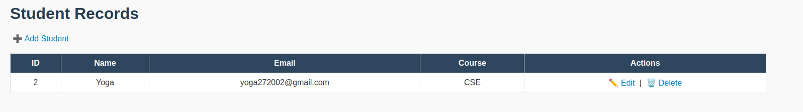
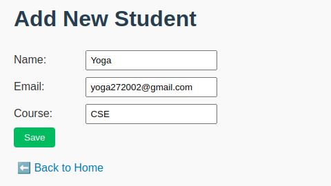
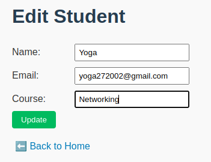
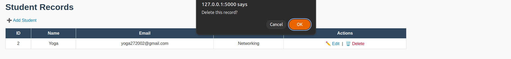

# Student Database Management System

A simple **CRUD web application** built with **Python (Flask) + SQLite** to manage student records.
This project demonstrates how to design and implement a **relational database**, build a web interface, and perform CRUD (Create, Read, Update, Delete) operations.

---

## Features

* Add new students with Name, Email, and Course.
* View all students in a table format.
* Edit student details.
* Delete student records.
* Data stored locally in `students.db` (SQLite).

---

## Project Structure

```
student_dbms/
│── app.py             # Flask backend (main app)
│── requirements.txt   # Dependencies (Flask)
│── students.db        # SQLite database (auto-created on first run)
│── templates/
│    ├── index.html    # Home page (list students)
│    ├── add.html      # Add new student form
│    ├── edit.html     # Edit student form
│── static/
     ├── style.css     # Styling
```

---

## Tech Stack

* **Backend:** Python (Flask)
* **Database:** SQLite (`students.db`)
* **Frontend:** HTML, CSS, JavaScript
* **Environment:** Virtual Environment (`venv`)

---

## How it Works

Think of it like a **digital student register**:

```
[User/Browser] <---> [Flask Server] <---> [students.db]
```

* User interacts via **browser (forms + table)**.
* Flask processes requests and talks to the database.
* SQLite stores all records in a single `.db` file.

---

## Setup Instructions

### 1. Clone or Download the Project

```bash
git clone https://github.com/yogapc27/student_dbms
cd student_dbms
```

### 2. Create Virtual Environment

```bash
python3 -m venv venv
```

### 3. Activate Virtual Environment

* Linux / Mac:

  ```bash
  source venv/bin/activate
  ```
* Windows (cmd):

  ```bat
  venv\Scripts\activate
  ```

### 4. Install Requirements

```bash
pip install -r requirements.txt
```

### 5. Run the App

```bash
python app.py
```

### 6. Open in Browser

```
http://127.0.0.1:5000
```

---

## Example Usage

### ➕ Add Student

Fill out form:

```
Name: Yoga
Email: yoga@example.com
Course: Computer Science
```

### View Students

Table output:

```
+----+-------+------------------+-------------------+
| ID | Name  | Email            | Course            |
+----+-------+------------------+-------------------+
|  1 | Yoga | yoga@example.com| Computer Science    |
+----+-------+------------------+-------------------+
```

### Edit Student

Change Yoga's course → “Networking”.

### Delete Student

Remove Yoga's record.

---

## Learning Outcomes

* Designing **relational database schema**.
* Implementing **CRUD operations** with SQLite.
* Building a **Flask web app** with templates.
* Connecting frontend forms with backend database.

---

## Screenshots

### Home Page – Student List



### Add Student



### Edit / Update Student



### Delete Student


